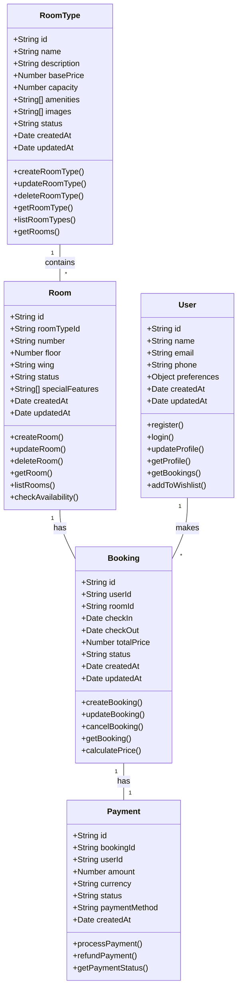

# Class Diagram Documentation

## Core Entities

### RoomType

## Relationships

1. **RoomType - Room (1:Many)**

   - One RoomType can have multiple Rooms
   - Each Room belongs to exactly one RoomType

2. **Room - Booking (1:Many)**

   - One Room can have multiple Bookings (over time)
   - Each Booking is associated with exactly one Room

3. **User - Booking (1:Many)**

   - One User can have multiple Bookings
   - Each Booking belongs to exactly one User

4. **Booking - Payment (1:1)**
   - Each Booking has exactly one Payment
   - Each Payment is associated with exactly one Booking

## Key Methods

### RoomType

- CRUD operations for room types
- Ability to list associated rooms
- Price management

### Room

- CRUD operations for individual rooms
- Availability checking
- Status management

### User

- Authentication operations
- Profile management
- Booking history access
- Wishlist management

### Booking

- Reservation creation and management
- Price calculation
- Status updates

### Payment

- Payment processing
- Refund handling
- Transaction status tracking
