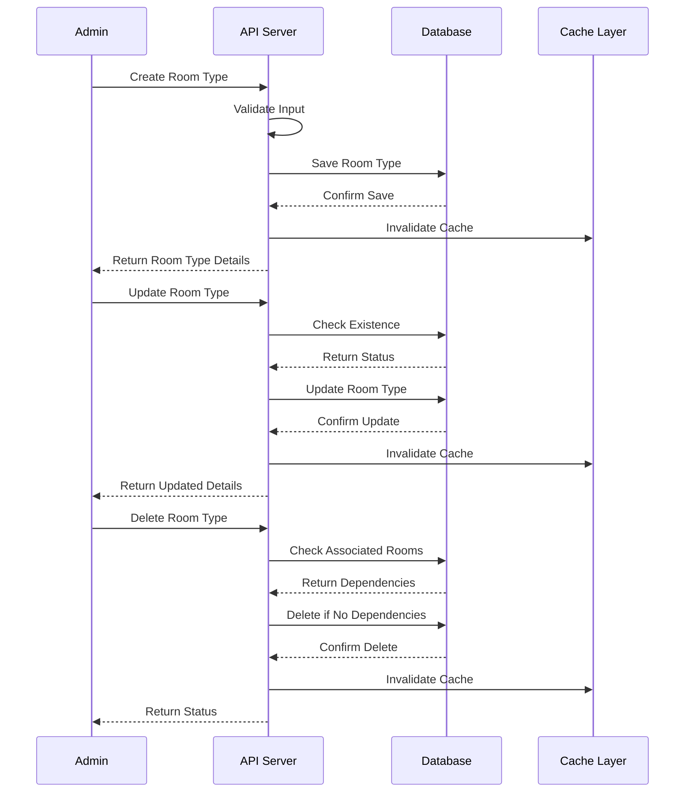
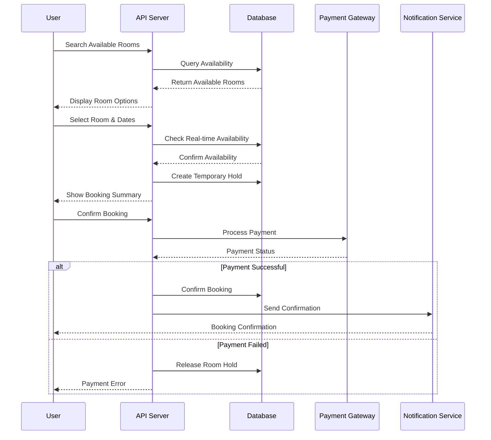
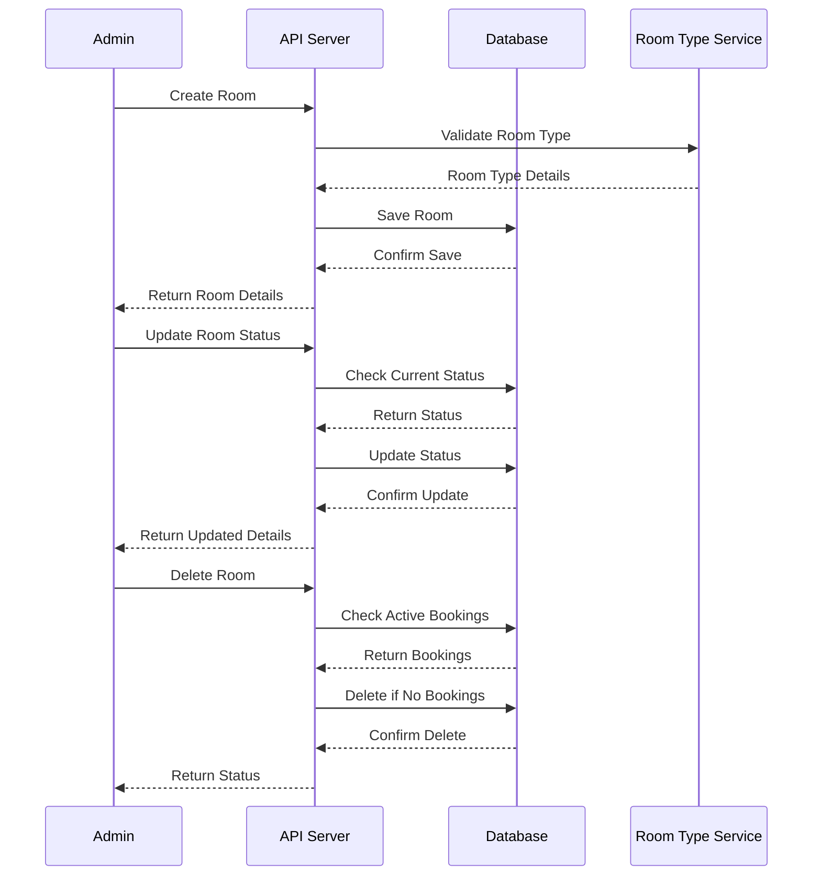

# Sequence Diagrams

## Room Type Management Process

## Room Booking Process

## Room Management Process

## Process Descriptions

### Room Type Management

1. **Creation Process**

   - Admin submits room type details
   - System validates input data
   - Saves to database
   - Invalidates cache
   - Returns confirmation

2. **Update Process**

   - Admin provides updated details
   - System checks existence
   - Updates database
   - Invalidates cache
   - Returns updated information

3. **Deletion Process**
   - Admin requests deletion
   - System checks for associated rooms
   - Prevents deletion if rooms exist
   - Deletes if no dependencies
   - Updates cache

### Room Booking

1. **Search Phase**

   - User searches for rooms
   - System queries database
   - Returns available options
   - Shows pricing and details

2. **Reservation Phase**

   - User selects room and dates
   - System checks real-time availability
   - Creates temporary hold
   - Shows booking summary

3. **Confirmation Phase**
   - User confirms booking
   - System processes payment
   - Creates booking record
   - Sends confirmation

### Room Management

1. **Room Creation**

   - Admin provides room details
   - System validates room type
   - Creates room record
   - Associates with room type

2. **Status Updates**

   - Admin updates room status
   - System checks current status
   - Updates if valid
   - Returns confirmation

3. **Room Deletion**
   - Admin requests deletion
   - System checks for active bookings
   - Prevents deletion if booked
   - Deletes if available

## Error Handling

1. **Validation Errors**

   - Input validation failures
   - Missing required fields
   - Invalid data formats

2. **Business Logic Errors**

   - Room type deletion with existing rooms
   - Room deletion with active bookings
   - Double booking prevention

3. **System Errors**
   - Database connection issues
   - Cache invalidation failures
   - Payment processing errors

## Security Considerations

1. **Authentication**

   - Admin operations require valid token
   - User operations require authentication
   - Token validation on each request

2. **Authorization**

   - Role-based access control
   - Operation-level permissions
   - Resource ownership validation

3. **Data Protection**
   - Sensitive data encryption
   - Secure payment processing
   - Audit logging
